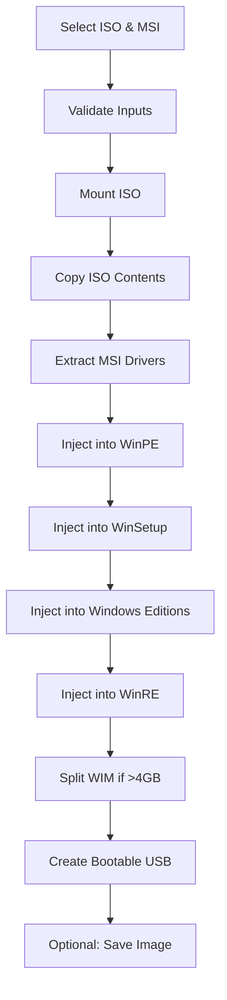

# Windows 11 Image & USB Creator

A professional PowerShell GUI tool for preparing Windows 11 installation images with injected drivers and creating bootable USB drives (UEFI-compatible, FAT32, 14GB+). This tool is especially useful for creating custom Windows 11 USB installers with integrated drivers from MSI packages, specifically designed for Microsoft Surface devices and other hardware requiring driver slipstreaming.


---

## 🎯 Overview

Similar in concept to Rufus, but specialized for driver integration before deployment. This tool streamlines the process of injecting hardware drivers (primarily Surface drivers from MSI packages) into Windows 11 ISO images, creating bootable USB drives with fully integrated drivers.

### Key Benefits
- **One-time setup**: Create a single USB with all drivers pre-installed
- **Zero-touch installation**: No need to install drivers post-Windows setup
- **Time-saving**: Eliminates manual driver installation on multiple devices
- **UEFI compatible**: Creates FAT32 bootable USB drives with proper partitioning
- **Edition flexibility**: Choose which Windows editions to process (Pro, Enterprise, etc.)
- **Graphical interface**: No command-line work required - all operations via GUI

---

## ✨ Features

### Version 3.0 (Latest)
- ✅ **Silent background processing** - No popup windows during DISM operations
- ✅ **Hidden console window** - Professional appearance with clean UI
- ✅ **Real-time USB drive information** - Shows drive details, size, filesystem, status
- ✅ **Enhanced progress tracking** - Detailed step-by-step progress with percentage
- ✅ **Time warnings** - Alerts users that operations can take 45-60 minutes
- ✅ **Professional UI** - Rufus-inspired interface with blue theme
- ✅ **Visual warnings** - Color-coded alerts for drive size and data loss
- ✅ **About dialog** - Version info and system requirements

### Version 2.0
- ✅ **Driver injection** - Slipstreams drivers into all Windows images (WinPE, WinSetup, WinRE, Editions)
- ✅ **ISO integrity validation** - Verifies ISO structure before processing
- ✅ **Disk space checking** - Ensures 25GB+ free space before operations
- ✅ **Driver validation** - Scans for .inf files and checks digital signatures
- ✅ **Edition selection** - Choose specific Windows editions to process
- ✅ **Progress dialogs** - Visual feedback with cancellation support
- ✅ **Error recovery** - Automatic cleanup of mounted WIM images on failure
- ✅ **WIM splitting** - Automatically splits install.wim >4GB for FAT32 compatibility
- ✅ **Saved image management** - Save and reuse prepared images
- ✅ **USB creation** - Creates 14GB FAT32 bootable UEFI USB drives
- ✅ **Label preservation** - Maintains original ISO volume labels
- ✅ **Repair/Cleanup utility** - Fixes stuck WIM mounts

### Core Functionality
- **Multiple injection points**: Drivers injected into:
  - WinPE (Windows Preinstallation Environment)
  - Windows Setup Environment
  - Windows Recovery Environment (WinRE)
  - All Windows 11 editions in install.wim
- **Three creation modes**:
  1. **Prepare Image with Drivers** - Full driver injection workflow
  2. **Create from Saved Image** - Quick USB creation from previously prepared images
  3. **Create USB from ISO** - Direct USB creation without driver injection

---

## 📋 System Requirements

### Operating System
- Windows 10 (20H2 or later)
- Windows 11 (any version)
- **Administrator privileges required**

### Software Dependencies
- PowerShell 5.1 or higher (included in Windows)
- .NET Framework 4.7.2+ (included in Windows 10/11)
- DISM (Deployment Image Servicing and Management) - built into Windows

### Hardware Requirements
- **Disk Space**: Minimum 25GB free space on C: drive
  - ~5GB for extracted ISO files
  - ~2GB for extracted drivers
  - ~15GB for mounted WIM images during processing
  - ~3GB buffer for temporary operations
- **RAM**: 8GB+ recommended (DISM operations are memory-intensive)
- **USB Drive**: 14GB+ for bootable USB creation (FAT32 formatted)
- **Processor**: Modern multi-core CPU recommended (driver injection is CPU-intensive)

### Input Files
- **Windows 11 ISO image** - Official Microsoft Windows 11 ISO (Business or Consumer editions)
- **Driver MSI package** - Surface drivers or other MSI-packaged drivers (e.g., Surface_Laptop_WiFi_drivers.msi)

---

## 🚀 Usage

### Quick Start

1. **Run as Administrator**
   ```powershell
   # Right-click WinImagePrep_V3.ps1 → Run with PowerShell (as Admin)
   # Or from PowerShell console:
   Set-ExecutionPolicy -Scope Process -ExecutionPolicy Bypass
   .\WinImagePrep_V3.ps1
   ```

2. **Select Windows 11 ISO**
   - Click "Browse..." next to ISO field
   - Select your Windows 11 ISO file
   - Optional: Click "Verify" to validate ISO integrity

3. **Select Driver MSI**
   - Click "Browse..." next to Driver MSI field
   - Select your Surface drivers MSI file

4. **Configure Options** (Optional)
   - Click "Select Specific Windows Editions" to choose which editions to process
   - Default: All editions will be processed

5. **Start Processing**
   - Click "Prepare Image with Drivers"
   - Read the time warning (45-60 minutes typical)
   - Click "Yes" to proceed

6. **Create Bootable USB**
   - After image preparation completes, select USB drive from dropdown
   - Click through prompts to create bootable USB
   - Choose to save prepared image for future use (optional)

### Alternative Workflows

#### Create from Saved Image
1. Click "Create from Saved Image"
2. Select previously saved image from dropdown
3. Select USB drive
4. Click "Create USB" - much faster than full preparation!

#### Create USB from ISO (No Drivers)
1. Click "Create USB from ISO"
2. Select Windows 11 ISO
3. Select USB drive
4. Click "Create USB from ISO" - creates standard bootable USB without driver injection

---

## 📂 Directory Structure

```
C:\WinImagePrep\
│
├── WinImagePrep_V2.ps1       # Version 2 (stable, visible operations)
├── WinImagePrep_V3.ps1       # Version 3 (recommended, silent operations)
├── README.md                 # This file
│
├── Windows11\                # Working directory for Windows files (temporary)
├── Drivers\                  # Extracted drivers from MSI (temporary)
├── Mount\                    # Temporary mount root for WIM files (WinPE, WinSetup, Edition_*, WinRE_*)
├── Config\                   # Configuration storage (iso-label.txt)
├── SavedImages\              # User-saved prepared images (persistent)
│   ├── Surface_Laptop_Win11_20260519\
│   │   ├── boot\
│   │   ├── efi\
│   │   ├── sources\
│   │   └── iso-label.txt
│   └── ...
└── ISO_Temp\                 # Temporary ISO extraction (for USB-from-ISO feature)
```

### Automatic Cleanup
- `Windows11\`, `Drivers\`, `Mount\`, and `ISO_Temp\` are automatically cleaned after operations
- `SavedImages\` persists for future use
- `Config\` is cleaned after saved image creation

---

## 🚀 Sample Workflows

### Workflow 1: Prepare USB with Drivers (Full Process)
1. Select Windows 11 ISO file
2. Select driver MSI file
3. Click "Prepare Image with Drivers"
4. Read time warning (45-60 minutes typical) and click "Yes"
5. Insert USB drive when prompted
6. Confirm USB selection and data erasure warning
7. Optionally save prepared image for future use

### Workflow 2: Quick USB from Saved Image
1. Click "Create from Saved Image"
2. Choose previously saved image from dropdown
3. Select USB drive
4. Click "Create USB" - **much faster than full preparation!**

### Workflow 3: Direct USB from ISO (No Drivers)
1. Click "Create USB from ISO"
2. Select Windows 11 ISO
3. Select USB drive
4. Click "Create USB from ISO" - creates standard bootable USB without driver injection

---

## ⚙️ How It Works

### Driver Injection Process



### Technical Details

#### 1. **ISO Mounting & Extraction**
   - Uses Windows `Mount-DiskImage` to mount ISO
   - Copies all files with `robocopy` for speed
   - Clears read-only attributes for modification

#### 2. **Driver Extraction**
   - Uses `msiexec /a` to extract MSI contents
   - Validates presence of `.inf` driver files
   - Checks for digital signatures (`.cat` files)

#### 3. **WinPE Injection** (boot.wim Index 1)
   - Mounts WinPE image
   - Runs `DISM /Add-Driver` recursively
   - Ensures drivers available during initial boot

#### 4. **WinSetup Injection** (boot.wim Index 2)
   - Mounts Windows Setup environment
   - Injects drivers for setup process
   - Critical for detecting hardware during installation

#### 5. **Edition Processing** (install.wim)
   - Enumerates all Windows editions (Pro, Enterprise, Home, etc.)
   - User can select specific editions or process all
   - Each edition mounted and injected separately
   - **Time intensive**: 10-15 minutes per edition

#### 6. **WinRE Injection** (Recovery Environment)
   - Locates `Winre.wim` inside each edition
   - Injects drivers for recovery scenarios
   - Ensures hardware detection in recovery mode

#### 7. **FAT32 Optimization**
   - Checks if `install.wim` exceeds 4GB (FAT32 file size limit)
   - Automatically splits into `install.swm`, `install2.swm`, etc.
   - Uses DISM split with 3.8GB chunks for compatibility

#### 8. **USB Creation**
   - Removes all existing partitions
   - Initializes disk as MBR (UEFI/Legacy compatible)
   - Creates 14GB partition (Windows 11 minimum recommendation)
   - Formats as FAT32 for UEFI compatibility
   - Copies all modified files to USB
   - Preserves ISO volume label

---

## 🛠️ Troubleshooting

### Common Issues

#### "Access Denied" or "Administrator required"
**Solution**: Always run as Administrator
```powershell
# Check if running as admin:
([Security.Principal.WindowsPrincipal] [Security.Principal.WindowsIdentity]::GetCurrent()).IsInRole([Security.Principal.WindowsBuiltInRole]::Administrator)
```

#### "Execution Policy" error
**Solution**: Bypass execution policy for the session
```powershell
Set-ExecutionPolicy -Scope Process -ExecutionPolicy Bypass
.\WinImagePrep_V3.ps1
```

#### Stuck at 50% progress / Application appears frozen
**Expected Behavior**: DISM driver injection operations take 10-15 minutes **per operation**
- Total expected time: 45-60 minutes for full injection
- Progress updates between major steps (not during DISM operations)
- Do NOT close the application - it's working!

#### "Error 0x800F0823" - Access denied during DISM
**Cause**: WIM image is already mounted or locked
**Solution**: Use "Repair/Cleanup" button to force unmount all images

#### "Error: Not enough disk space"
**Solution**: Free up space on C: drive
- Need 25GB minimum
- Delete temporary files: `C:\Windows\Temp\`
- Clean up old Windows updates: `Disk Cleanup → Clean up system files`

#### "No USB drives found"
**Solution**: 
- Ensure USB drive is physically connected
- Try different USB port
- Check if USB appears in Disk Management
- Click "Refresh" button in application

#### USB drive shows as "Not formatted" after creation
**Cause**: Some systems show this briefly while finalizing
**Solution**: 
- Safely eject and reinsert USB
- Verify files exist on USB manually
- Boot test in UEFI mode

#### "The file install.wim was not found"
**Cause**: Some ISOs use install.esd instead of install.wim
**Solution**: Convert ESD to WIM first:
```powershell
dism /Get-WimInfo /WimFile:install.esd
dism /Export-Image /SourceImageFile:install.esd /SourceIndex:1 /DestinationImageFile:install.wim /Compress:max /CheckIntegrity
```

### Manual Cleanup

If the tool crashes or is forcibly closed:

```powershell
# Check mounted images
Get-WindowsImage -Mounted

# Force unmount all
Get-WindowsImage -Mounted | ForEach-Object {
    Dismount-WindowsImage -Path $_.Path -Discard
}

# Clean directories
Remove-Item -Path C:\WinImagePrep\Windows11\* -Recurse -Force
Remove-Item -Path C:\WinImagePrep\Drivers\* -Recurse -Force
Remove-Item -Path C:\WinImagePrep\Mount\* -Recurse -Force
```

Or simply click **"Repair/Cleanup"** button in the application.

---

## 📊 Performance & Timing

### Typical Processing Times

| Operation | Duration | Notes |
|-----------|----------|-------|
| ISO Validation | 30-60 seconds | Depends on ISO size |
| ISO Extraction | 2-5 minutes | ~5GB of files |
| MSI Extraction | 1-2 minutes | Varies by driver package size |
| WinPE Injection | 5-10 minutes | First DISM operation |
| WinSetup Injection | 5-10 minutes | Second DISM operation |
| Edition Injection | 10-15 min **each** | Multiply by number of editions (typically 5-10) |
| WinRE Injection | 3-5 min each | Per edition with WinRE |
| WIM Splitting | 3-5 minutes | Only if install.wim >4GB |
| USB Creation | 5-10 minutes | ~6GB file copy |
| **Total Time** | **45-90 minutes** | Full workflow with all editions |

### Optimization Tips
- **Select specific editions** instead of processing all (saves 30-60 minutes)
- Use an **SSD** for C:\WinImagePrep working directory
- **Close other applications** to free up RAM for DISM
- **Disable antivirus temporarily** (real-time scanning slows DISM)
- Use **USB 3.0+ drives** for faster USB creation

---

## 🔒 Security Considerations

### Administrator Privileges
- **Required**: Full disk access, WIM mounting, partition management
- **Best Practice**: Run only trusted scripts with admin rights
- **Audit**: Review script source code before execution

### Driver Validation
- Tool checks for `.cat` signature files
- **Recommendation**: Only use official driver packages from hardware manufacturers
- **Surface drivers**: Download from Microsoft Surface support website

### Antivirus
- Some AV software may flag PowerShell scripts as suspicious
- **False Positive**: Common with scripts requiring admin privileges
- **Mitigation**: Review script, add exception, or use digital signature

---

## 🔮 Roadmap / Future Development

### Next Major Version: C# WPF Native Application

**Planned Features:**
- ✨ **True async operations** - No UI freezing, real-time progress during DISM
- ✨ **Faster performance** - Native C# is 5-10x faster than PowerShell
- ✨ **Digital signing** - No antivirus false positives
- ✨ **Professional installer** - MSI/MSIX package with Start Menu integration
- ✨ **Smaller footprint** - ~5MB exe vs current PowerShell overhead
- ✨ **Enhanced UI** - Modern Fluent Design with animations
- ✨ **Multi-threading** - Process multiple editions in parallel
- ✨ **Update checker** - Automatic version checking via GitHub
- ✨ **Telemetry** (optional) - Anonymous usage statistics for improvements
- ✨ **Log export** - Save operation logs for troubleshooting
- ✨ **Dark mode** - Theme options for user preference

**Timeline**: Under development, targeting Q3 2026

### Feature Requests (Current Version)
- [ ] Support for .esd images (in addition to .wim)
- [ ] Network share support (UNC paths)
- [ ] ISO creation (export modified files back to ISO)
- [ ] Multiple MSI support (inject drivers from multiple sources)
- [ ] Configurable partition sizes (currently fixed at 14GB)
- [ ] exFAT support for drives >32GB (for future-proofing)
- [ ] Command-line interface for automation/scripting

---

## 📝 Changelog

### Version 3.0 (May 19, 2026)
- **NEW**: Silent background processing (no popup windows)
- **NEW**: Hidden PowerShell console for cleaner appearance
- **NEW**: Real-time USB drive information panel
- **NEW**: Time warning dialog (45-60 minute expected duration)
- **NEW**: Professional blue-themed UI
- **NEW**: About dialog with version information
- **IMPROVED**: Visual warnings with color-coded alerts
- **IMPROVED**: Better progress tracking with detailed messages
- **IMPROVED**: Enhanced error messages with context

### Version 2.0 (May 18, 2026)
- **NEW**: Edition selection dialog (choose specific Windows editions)
- **NEW**: Saved image management (save and reuse prepared images)
- **NEW**: ISO integrity validation
- **NEW**: Disk space checking (25GB requirement)
- **NEW**: Driver validation with signature checking
- **NEW**: Progress dialogs with cancellation support
- **NEW**: Error recovery with automatic cleanup
- **NEW**: Repair/Cleanup utility for stuck mounts
- **NEW**: USB-from-ISO feature (direct USB creation without drivers)
- **NEW**: Create-from-saved-image workflow
- **IMPROVED**: WIM splitting for FAT32 compatibility
- **IMPROVED**: Volume label preservation
- **IMPROVED**: Detailed operation logging
- **FIXED**: Unicode character encoding issues
- **FIXED**: String interpolation parser errors

### Version 1.0 (Initial Release)
- Basic driver injection into Windows 11 ISO
- Simple USB creation workflow
- Manual mount/unmount operations

---

## 🤝 Contributing

Contributions are welcome! If you'd like to improve this tool:

1. Fork the repository
2. Create a feature branch (`git checkout -b feature/AmazingFeature`)
3. Commit your changes (`git commit -m 'Add some AmazingFeature'`)
4. Push to the branch (`git push origin feature/AmazingFeature`)
5. Open a Pull Request

### Development Guidelines
- Test on both Windows 10 and Windows 11
- Verify with multiple ISO sources (Consumer/Business editions)
- Include error handling for all external commands
- Add comments for complex logic
- Update README with new features

---

## ⚠️ Important Notes

- **ALL DATA ON THE SELECTED USB DRIVE WILL BE ERASED** - Triple-check drive selection before proceeding
- For ISOs with `install.wim` larger than 4GB, the script automatically splits to `install.swm` files for FAT32 compatibility
- Some operations (mounting, driver injection, formatting) can take **45-60 minutes or more** - be patient!
- This tool is designed for clean, UEFI-compatible USB creation (not for legacy BIOS)
- All operations require Administrator privileges
- All destructive actions prompt for explicit user confirmation

---

## 🚨 Known Limitations

- **Architecture**: Only supports x64 and ARM64 Windows 11 ISOs with standard install.wim layout
- **USB Size**: Requires minimum 14GB USB drive (32GB+ recommended for future updates)
- **BIOS Support**: Designed for UEFI only (not compatible with legacy BIOS boot)
- **Driver Format**: Only MSI-packaged drivers supported (must contain .inf files)
- **Security Software**: Some antivirus or endpoint protection may interfere with file operations
- **Network Paths**: UNC paths not currently supported - use local files only
- **ESD Images**: Install.esd format requires manual conversion to install.wim first

---

## 🔒 Security & Safety

### Data Collection
- The script does **NOT** collect or transmit any data
- All file operations are performed locally on your machine
- No telemetry, analytics, or external network calls

### Permissions
- **Administrator privileges required** for:
  - Mounting/unmounting disk images
  - Partition management and formatting
  - DISM operations on WIM files
- **Best Practice**: Review script source code before granting admin access

### Confirmations
- All destructive actions require explicit user confirmation
- USB drive selection shows full drive details before formatting
- Multiple warnings for data loss scenarios

### Driver Safety
- Tool validates presence of .inf driver files
- Checks for digital signatures (.cat files)
- **Recommendation**: Only use official drivers from hardware manufacturer websites
- **Surface Drivers**: Download from [Microsoft Surface Support](https://support.microsoft.com/en-us/surface/download-drivers-and-firmware-for-surface)

---

## 📜 License

This project is licensed under the MIT License:

```
MIT License

Copyright (c) 2026 andrew-kemp

Permission is hereby granted, free of charge, to any person obtaining a copy
of this software and associated documentation files (the "Software"), to deal
in the Software without restriction, including without limitation the rights
to use, copy, modify, merge, publish, distribute, sublicense, and/or sell
copies of the Software, and to permit persons to whom the Software is
furnished to do so, subject to the following conditions:

The above copyright notice and this permission notice shall be included in all
copies or substantial portions of the Software.

THE SOFTWARE IS PROVIDED "AS IS", WITHOUT WARRANTY OF ANY KIND, EXPRESS OR
IMPLIED, INCLUDING BUT NOT LIMITED TO THE WARRANTIES OF MERCHANTABILITY,
FITNESS FOR A PARTICULAR PURPOSE AND NONINFRINGEMENT. IN NO EVENT SHALL THE
AUTHORS OR COPYRIGHT HOLDERS BE LIABLE FOR ANY CLAIM, DAMAGES OR OTHER
LIABILITY, WHETHER IN AN ACTION OF CONTRACT, TORT OR OTHERWISE, ARISING FROM,
OUT OF OR IN CONNECTION WITH THE SOFTWARE OR THE USE OR OTHER DEALINGS IN THE
SOFTWARE.
```

---

## 👤 Author

**andrew-kemp**

Contributions, issues, and feature requests are welcome!

---

## � Acknowledgments

- **Microsoft DISM** - Core driver injection technology
- **Rufus** - Inspiration for UI/UX design
- **Surface Driver Team** - MSI-packaged drivers
- **PowerShell Community** - WPF XAML examples and best practices

---

## 📞 Support

### Issues & Bug Reports
- GitHub Issues: [Create an issue](https://github.com/andrew-kemp/WinImagePrep/issues)
- Include: Windows version, PowerShell version, full error message, operation log

### Questions & Discussion
- GitHub Discussions: [Ask a question](https://github.com/andrew-kemp/WinImagePrep/discussions)

### Documentation
- [Microsoft DISM Reference](https://docs.microsoft.com/en-us/windows-hardware/manufacture/desktop/dism-driver-servicing-command-line-options)
- [Surface Drivers Download](https://support.microsoft.com/en-us/surface/download-drivers-and-firmware-for-surface)
- [Windows 11 ISO Download](https://www.microsoft.com/software-download/windows11)

---

## ⚠️ Disclaimer

This tool is provided "as-is" without warranty of any kind. Always:
- **Backup important data** before operations
- **Test USB drives** in non-production environments first
- **Verify driver sources** are official and trusted
- **Use official Windows ISOs** from Microsoft

The author is not responsible for data loss, hardware issues, or failed Windows installations resulting from use of this tool.

---

## 🌟 Star History

If you find this tool useful, please consider giving it a star on GitHub! ⭐

---

**Made with ❤️ for the Windows deployment community**

---

*Last Updated: May 19, 2026*  
*Current Version: 3.0*  
*Status: Active Development*
